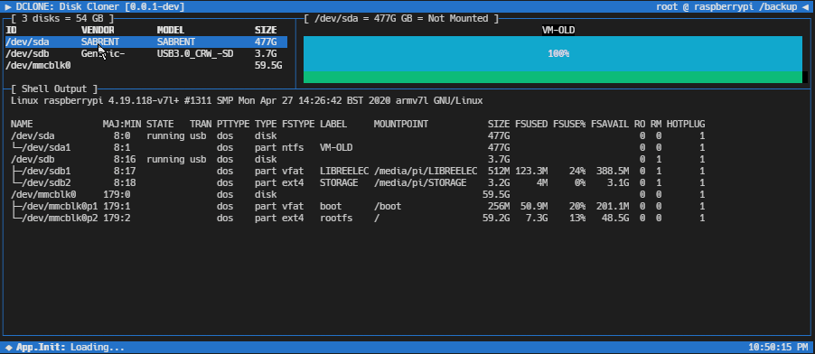

# DCLONE: Terminal Menu Guided Disk Imaging
## Simple frontend for common open-source tools: lsblk dd squashfs kpartx

---

#### <code><a href='https://github.com/cogsmith/dclone'> [GITHUB REPO]</a></code>

#### <code><a href='https://github.com/cogsmith/dclone/blob/main/app.js'>🧾 [VIEW APP SOURCE CODE]</a></code>

#### <code><a href='https://github.com/cogsmith/dclone/projects/1'>📅 [PROJECT TRACKER BOARD]</a></code>

---

<!--  -->

---

* lsblk
* dd
* squashfs
* kpartx

---

Single step streaming technique originally sourced from this StackOverflow post:
https://unix.stackexchange.com/a/75590/23232

---

---

Disk cloning app that uses open-source tools like dd mksquashfs and kpartx to backup and restore images easily.

It gives a guided menu interface to picking out a disk and entering a filename, then lets you observe the streaming output from spawned tasks in an embedded tty buffer.

